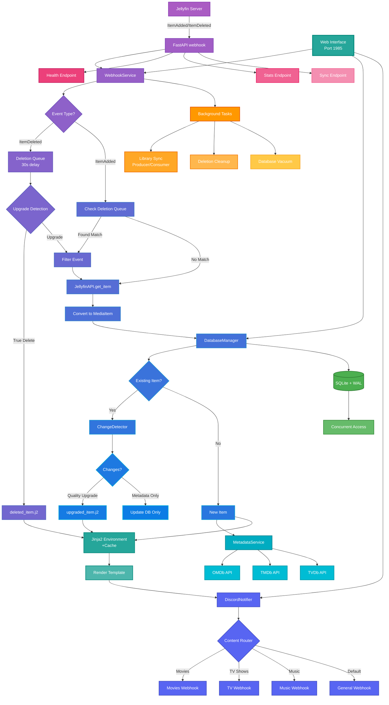

# Jellynouncer

<div align="center">
  
  
  <p align="center">
    <strong>🔔 Intelligent Discord Notifications for Jellyfin Media Server</strong>
  </p>
  
  <p align="center">
    Advanced webhook service with quality upgrade detection, multi-channel routing, and rich customization
  </p>
</div>

<div align="center">

[](https://opensource.org/licenses/MIT)
[](https://www.python.org/downloads/)
[](https://react.dev/)
[](https://hub.docker.com/r/markusmcnugen/jellynouncer)
[](https://github.com/MarkusMcNugen/Jellynouncer/issues)
[](https://github.com/MarkusMcNugen/Jellynouncer/stargazers)
[](https://github.com/MarkusMcNugen/Jellynouncer/releases)

</div>

---

## 📑 Table of Contents

- [Overview](#-overview)
- [Key Features](#-key-features)
  - [Web Interface](#-web-interface)
  - [Smart Change Detection](#-smart-change-detection)
  - [Multi-Channel Discord Routing](#-multi-channel-discord-routing)
  - [Advanced Template System](#-advanced-template-system)
  - [External Metadata Integration](#-external-metadata-integration)
  - [Production-Ready Features](#-production-ready-features)
  - [Deployment & Operations](#-deployment--operations)
- [Quick Start](#-quick-start)
  - [Prerequisites](#prerequisites)
  - [Docker Compose](#docker-compose-recommended)
  - [Docker Run](#docker-run)
  - [Manual Installation](#manual-installation)
- [Templates](#-templates)
  - [Template Types](#template-types)
- [Configuration](#%EF%B8%8F-configuration)
  - [Getting API Keys](#getting-api-keys)
  - [Advanced Configuration](#advanced-configuration)
- [How It Works](#-how-it-works)
  - [Architecture Overview](#architecture-overview)
- [API Endpoints](#-api-endpoints)
  - [Webhook Service](#webhook-service-port-1984)
  - [Web Interface API](#web-interface-api-port-1985)
- [Troubleshooting](#%EF%B8%8F-troubleshooting)
  - [Common Issues](#common-issues)
  - [Debug Mode](#debug-mode)
  - [Log Locations](#log-locations)
- [Documentation](#-documentation)
- [Contributing](#-contributing)
  - [Development Setup](#development-setup)
  - [Code Style](#code-style)
  - [Tech Stack](#tech-stack)
- [License](#-license)
- [Acknowledgments](#-acknowledgments)
- [Support](#-support)

---

## 📖 Overview

**Jellynouncer** is an advanced intermediary webhook service that bridges Jellyfin media server with Discord, providing intelligent notifications for media library changes. It goes beyond simple "new item" alerts by detecting quality upgrades, managing multi-channel routing, and offering extensive customization through Jinja2 templates.

The service acts as a smart filter between Jellyfin's webhook events and Discord notifications, analyzing changes to determine what's truly noteworthy - distinguishing between new content additions and quality improvements like resolution upgrades (1080p → 4K) or HDR additions.

> [!WARNING]
> **ALPHA SOFTWARE NOTICE**
> 
> This software is currently in alpha development. While core functionality may sometimes be stable, you may encounter critical bugs at any time while ongoing development occurs.

## ✨ Key Features

### 🌐 Web Interface

<details>
<summary>📊 <b>Real-time Dashboard</b> - Monitor service health and statistics</summary>

**Overview Page Features:**
- **Jellyfin Server Stats**: Total library items, server version, online status
- **Local Database Sync**: Items synced, database size, last sync time, sync progress
- **Processing Pipeline**: Live webhook counts, filtering statistics, notification success rates
- **Activity Charts**: 24-hour trend graphs for webhooks and notifications
- **Content Distribution**: Visual breakdown by media type (Movies, TV, Music)
- **Discord Routing**: Channel-specific message counts and distribution
- **Filtering Intelligence**: Real-time spam prevention statistics
- **Recent Notifications**: Last 10 processed items with status and details
- **System Health**: Service status, CPU/memory usage, uptime metrics

**Auto-refresh**: Dashboard updates every 30 seconds automatically

</details>

<details>
<summary>⚙️ <b>Configuration Editor</b> - Manage all settings through an intuitive interface</summary>

**Configuration Sections:**
- **Jellyfin Settings**: Server URL, API key, user ID, client identification
- **Discord Webhooks**: Multiple webhook URLs with individual enable/disable toggles
- **Content Routing**: Automatic routing rules for movies, TV, and music
- **Notification Options**: Customize triggers for upgrades, filtering, and grouping
- **External APIs**: Configure OMDb, TMDb, and TVDb for enhanced metadata
- **Database Settings**: Path, maintenance intervals, performance tuning
- **Server Options**: Ports, logging levels, development mode
- **Security**: Authentication, JWT secrets, webhook authentication
- **SSL/TLS**: Certificate management for HTTPS support

**Features:**
- Hover tooltips explaining each setting
- Instant validation with error messages
- Save individual sections or all at once
- Environment variable override indicators
- Test buttons for Jellyfin and Discord connections

</details>

<details>
<summary>📝 <b>Template Editor</b> - Customize Discord notifications with Jinja2</summary>

**Editor Features:**
- **Syntax Highlighting**: Full Jinja2 syntax support with color coding
- **Template Types**: Edit templates for new items, upgrades, deletions, and grouped messages
- **Live Preview**: See how your templates will look (coming soon)
- **Variable Reference**: Built-in documentation of available variables
- **Undo/Redo**: Full editing history
- **Save & Restore**: Backup and restore template versions
- **Hot Reload**: Changes apply immediately without restart

**Available Templates:**
- `new_item.j2` - Single new item notifications
- `upgraded_item.j2` - Quality upgrade notifications
- `deleted_item.j2` - Item removal notifications
- `new_items_grouped.j2` - Batched new items
- `upgraded_items_grouped.j2` - Batched upgrades

</details>

<details>
<summary>📜 <b>Log Viewer</b> - Browse and filter logs with color coding</summary>

**Log Viewer Features:**
- **Dual Log Support**: View both `jellynouncer.log` and `jellynouncer-web.log`
- **Real-time Updates**: Logs update automatically as new entries arrive
- **Color-Coded Levels**: DEBUG (gray), INFO (blue), WARNING (yellow), ERROR (red)
- **Advanced Filtering**: 
  - Filter by log level (DEBUG, INFO, WARNING, ERROR)
  - Filter by component (webhook, discord, jellyfin, database, etc.)
  - Search for specific text
  - Time range selection
- **Line Limits**: View last 100, 500, or 1000 lines
- **Export**: Download filtered logs for analysis
- **Performance**: Virtual scrolling for smooth handling of large logs

</details>

<details>
<summary>🔐 <b>Security Features</b> - JWT authentication and SSL/TLS support</summary>

**Authentication System:**
- **JWT-based**: Short-lived access tokens (30min) with refresh tokens (7 days)
- **Bcrypt Hashing**: Industry-standard password encryption
- **Setup Wizard**: Guided initial authentication setup
- **Password Requirements**: Minimum 8 characters, complexity optional
- **Session Management**: Automatic token refresh, secure logout
- **Recovery Options**: JWT secret override for emergency access

**SSL/TLS Support:**
- **Certificate Formats**: PEM (separate cert/key) or PFX/PKCS12 (bundled)
- **Port Configuration**: Default HTTPS on port 9000
- **Auto-redirect**: Optional HTTP to HTTPS redirect
- **Certificate Upload**: Web-based certificate management
- **Validation**: Automatic certificate validation and expiry warnings

</details>

### 🧠 Smart Change Detection

#### Intelligent Media Analysis

<details>
<summary>🎯 <b>Intelligent Analysis</b> - Distinguishes between new content and quality upgrades</summary>

The system uses sophisticated logic to differentiate between:
- **New Content**: Items that have never been seen before in your library
- **Quality Upgrades**: Existing items replaced with better versions
- **Metadata Updates**: Changes to descriptions, artwork, or tags (ignored)
- **File Reorganization**: Moving or renaming files without content changes

This intelligence prevents duplicate notifications while ensuring you're aware of meaningful changes.

</details>

<details>
<summary>🔍 <b>Technical Detection</b> - Identifies resolution, codec, and audio improvements</summary>

Automatically detects and reports technical improvements:
- **Resolution Upgrades**: 480p → 720p → 1080p → 4K → 8K
- **Video Codec Improvements**: MPEG-2 → H.264 → H.265/HEVC → AV1
- **Audio Enhancements**: 
  - Channel upgrades: Mono → Stereo → 5.1 → 7.1 → Atmos
  - Codec improvements: MP3 → AAC → FLAC/DTS → TrueHD
- **HDR Additions**: SDR → HDR10 → HDR10+ → Dolby Vision
- **Subtitle Changes**: Added or removed subtitle tracks

Each improvement is clearly identified in the Discord notification.

</details>

<details>
<summary>📊 <b>Content Hashing</b> - Blake2b fingerprinting prevents duplicate notifications</summary>

Jellynouncer uses a sophisticated content hashing system to detect quality upgrades:

**Algorithm**: Blake2b (32-byte digest) - Faster than SHA-256 with equal security

**Fields Included in Hash**:
- **Core**: `name`, `item_type`
- **Video**: `video_height`, `video_width`, `video_codec`, `video_profile`, `video_range`, `video_framerate`, `video_bitrate`, `video_bitdepth`
- **Audio**: `audio_codec`, `audio_channels`, `audio_bitrate`, `audio_samplerate`
- **Subtitles**: `subtitle_count`, `subtitle_languages` (sorted), `subtitle_formats` (sorted)
- **File**: `file_size`

**Not Included** (intentionally excluded to prevent false positives):
- Metadata fields (`overview`, `genres`, `studios`, `tags`)
- External IDs (`imdb_id`, `tmdb_id`, `tvdb_id`)
- File paths (allows moving/renaming without triggering upgrades)
- Timestamps and dates

This design ensures that only actual quality changes trigger upgrade notifications, while metadata updates and file reorganization are ignored.

</details>

<details>
<summary>⚙️ <b>Customizable Triggers</b> - Configure which changes warrant notifications</summary>

Jellynouncer allows you to customize exactly which types of quality changes trigger upgrade notifications:

**Available Triggers** (`watch_changes` configuration):

| Trigger | Default | Description | Example Changes |
|---------|---------|-------------|-----------------|
| `resolution` | `true` | Video resolution changes | 720p → 1080p → 4K |
| `video_codec` | `true` | Video codec improvements | H.264 → H.265/HEVC → AV1 |
| `audio_codec` | `true` | Audio codec upgrades | MP3 → AAC → FLAC, AC3 → DTS |
| `audio_channels` | `true` | Audio channel changes | Stereo (2.0) → 5.1 → 7.1 → Atmos |
| `hdr_status` | `true` | HDR format changes | SDR → HDR10 → HDR10+ → Dolby Vision |
| `file_size` | `false` | Significant size changes (>10%) | Complete re-encodes |
| `subtitles` | `true` | Subtitle track/language changes | Added/removed subtitle tracks |

**How Triggers Work**:
1. When an existing item is updated, the content hash changes (indicating actual file changes)
2. The system compares old vs new technical specifications
3. Only enabled triggers are checked for changes
4. If any enabled trigger detects a change, an "Upgraded" notification is sent
5. The notification includes details about what changed

**Configuration Examples**:

```json
{
  "notifications": {
    "watch_changes": {
      "resolution": true,      // Always notify for resolution upgrades
      "video_codec": true,    // Notify for codec improvements
      "audio_codec": true,    // Important for audio enthusiasts
      "audio_channels": true, // Track surround sound upgrades
      "hdr_status": true,     // Critical for HDR displays
      "file_size": false,     // Ignore size-only changes
      "subtitles": false      // Don't care about subtitle changes
    }
  }
}
```

**Use Cases**:
- **Home Theater Enthusiast**: Enable all audio and HDR triggers for complete awareness
- **Bandwidth Conscious**: Enable `video_codec` to track compression improvements
- **Visual Quality Focus**: Enable `resolution` and `hdr_status`, disable audio triggers
- **Minimal Notifications**: Enable only `resolution` for major upgrades

**Important Notes**:
- These triggers only apply to **upgrades** (when an existing item changes)
- New items always trigger notifications (subject to other filters)
- Triggers work in conjunction with the content hash - metadata-only changes never trigger upgrades
- File size trigger requires >10% change to avoid minor fluctuations

To configure via environment variables:
```bash
# Format: WATCH_CHANGES_<TRIGGER>=true/false
WATCH_CHANGES_RESOLUTION=true
WATCH_CHANGES_VIDEO_CODEC=true
WATCH_CHANGES_AUDIO_CODEC=false
WATCH_CHANGES_HDR_STATUS=true
```

</details>

<details>
<summary>🔄 <b>Rename Filtering</b> - Automatically detects and filters file renames</summary>

Jellynouncer uses two complementary methods to detect when files are renamed or moved without content changes:

**Method 1: Content Hash Comparison**
- Always active regardless of configuration
- Since `file_path` is excluded from the hash, moving or renaming files doesn't change the hash
- When a "new" item arrives with the same hash but different `item_id`, it's detected as a rename

**Method 2: Deletion Queue Matching**
- Used when Jellyfin sends both `ItemDeleted` and `ItemAdded` webhooks
- Matches deletions with additions based on content hash
- Provides additional rename detection for complex scenarios

**Configuration**: `filter_renames` (default: `true`)
- **When enabled**: Renames/moves are silently handled - database updated, no notifications sent
- **When disabled**: Renames/moves trigger "New Item" notifications, allowing users to track file reorganization

**Examples**:
- Moving `/movies/Action/movie.mkv` to `/movies/SciFi/movie.mkv` → Same hash, detected as rename
- Renaming `movie.1080p.mkv` to `movie.REMASTERED.1080p.mkv` → Same hash, detected as rename
- Actual quality upgrade `movie.1080p.mkv` to `movie.4K.mkv` → Different hash, detected as upgrade

To receive notifications for file moves/renames, set `filter_renames: false` in configuration or use environment variable `FILTER_RENAMES=false`.

</details>

<details>
<summary>⬆️ <b>Upgrade Detection</b> - Intelligently handles file upgrades and deletion filtering</summary>

Jellynouncer intelligently detects when files are being upgraded to prevent confusing notification pairs:

**How It Works**:
1. **Deletion Queue**: When an item is deleted, it's queued for 30 seconds instead of immediately notifying
2. **Upgrade Detection**: If an `ItemAdded` arrives for the same item name within 30 seconds:
   - **Same content hash** → Rename/move (filtered based on `filter_renames` setting)
   - **Different content hash** → Quality upgrade (sends "Upgraded" notification only)
   - **No matching add** → True deletion (sends "Deleted" notification after timeout)
3. **Background Cleanup**: A task monitors the queue and processes true deletions after 30 seconds

**Configuration**: `filter_deletes` (default: `true`)
- **When enabled**: 
  - Upgrades trigger only "Upgraded" notifications (no delete+add pair)
  - True deletions are notified after 30-second delay
  - Provides clean, meaningful notifications
- **When disabled**: 
  - All deletions trigger immediate notifications
  - Upgrades result in "Deleted" followed by "Added" notifications
  - Useful for tracking all library changes

**Example Scenarios**:
| Scenario | With Filtering | Without Filtering |
|----------|---------------|-------------------|
| **1080p → 4K Upgrade** | Single "Upgraded to 4K" notification | "Deleted" then "Added in 4K" notifications |
| **File Deleted** | "Deleted" notification (after 30s) | "Deleted" notification (immediate) |
| **File Renamed** | No notification (if `filter_renames=true`) | Based on `filter_renames` setting |

**Queue Monitoring**: The deletion queue status is visible in:
- Web interface dashboard
- `/stats` API endpoint
- Debug logs showing queue size and pending items

To receive immediate deletion notifications without filtering, set `filter_deletes: false` in configuration or use environment variable `FILTER_DELETES=false`.

</details>

### 🚀 Multi-Channel Discord Routing

<details>
<summary>📡 <b>Content-Type Routing</b> - Route different media to different Discord channels</summary>

**Routing Configuration:**
- **Movie Channel**: All movie notifications to dedicated channel
- **TV Channel**: Series and episode updates to TV channel  
- **Music Channel**: Audio content to music channel
- **Default Channel**: Fallback for unmatched content types

**Routing Rules:**
```json
{
  "routing": {
    "enabled": true,
    "movie_types": ["Movie"],
    "tv_types": ["Series", "Season", "Episode"],
    "music_types": ["Audio", "MusicAlbum", "AudioBook"],
    "fallback_webhook": "default"
  }
}
```

**Smart Features:**
- Automatic type detection from Jellyfin metadata
- Override routing with custom rules
- Test routing with preview mode
- Statistics per channel in dashboard

</details>

<details>
<summary>🔌 <b>Flexible Webhooks</b> - Unlimited webhooks with granular control</summary>

**Webhook Management:**
- **Multiple Webhooks**: Configure unlimited Discord webhook URLs
- **Individual Controls**: Enable/disable each webhook independently
- **Custom Names**: Assign meaningful names to webhooks
- **Priority System**: Set webhook priority for fallback chains
- **Testing**: Test each webhook individually from web interface

**Per-Webhook Settings:**
- Grouping mode (none, time-based, smart)
- Delay minutes for batching
- Maximum items per message
- Custom embed colors
- Mention roles (@everyone, @here, custom)

</details>

<details>
<summary>⏱️ <b>Smart Grouping</b> - Batch notifications intelligently</summary>

**Grouping Modes:**

**1. No Grouping** (Default)
- Each item gets its own notification
- Best for low-volume libraries
- Immediate notifications

**2. Time-Based Grouping**
- Batch all notifications within time window
- Configurable delay (1-60 minutes)
- Ideal for library scans
- Reduces notification spam

**3. Smart Grouping**
- Groups by content type and event
- Separate groups for movies, TV, music
- Separate groups for new vs upgraded
- Maximum 10 items per embed (Discord limit)

**Configuration:**
```json
{
  "grouping": {
    "mode": "smart",
    "delay_minutes": 5,
    "max_items": 10
  }
}
```

</details>

<details>
<summary>🚦 <b>Rate Limiting</b> - Respect Discord's API limits</summary>

**Rate Limit Management:**
- **Discord Limits**: 30 messages per minute per channel
- **Automatic Queueing**: Excess messages queued automatically
- **Smart Distribution**: Spreads messages across time to avoid bursts
- **Retry Logic**: Failed messages retry with exponential backoff
- **Queue Monitoring**: Real-time queue size in dashboard

**Queue Features:**
- Maximum 500 queued notifications
- Priority processing for important events
- Persistent queue survives restarts
- Manual queue flush option
- Queue statistics and history

**Configuration:**
```json
{
  "rate_limit": {
    "requests_per_period": 30,
    "period_seconds": 60,
    "max_queue_size": 500
  }
}
```

</details>

### 🎨 Advanced Template System

<details>
<summary>🎭 <b>Jinja2 Templates</b> - Full control over Discord embed formatting</summary>

**Template Engine Features:**
- **Full Jinja2 Support**: Variables, conditionals, loops, filters
- **Custom Filters**: Format file sizes, dates, durations
- **Macro Support**: Reusable template components
- **Inheritance**: Base templates for consistency
- **Error Handling**: Graceful fallbacks for missing data

</details>

<details>
<summary>🖼️ <b>Rich Media Display</b> - Posters, ratings, and technical details</summary>

**Discord Embed Components:**

**Thumbnail/Image:**
- Jellyfin poster/backdrop images
- Automatic fallback chain: Primary → Backdrop → Logo
- Image verification before sending
- CDN caching for performance

**Fields Display:**
- **Ratings**: IMDb, TMDb, TVDb scores with stars
- **Technical**: Resolution, codec, HDR, audio format
- **File Info**: Size, bitrate, duration
- **Cast & Crew**: Top 5 actors, director
- **Metadata**: Genres, studios, release date
- **Subtitles**: Available languages and formats

**Color Coding:**
- Green (5686453): New content
- Blue (3447003): Quality upgrades
- Red (15158332): Deletions
- Custom colors per webhook

</details>

<details>
<summary>📚 <b>Multiple Templates</b> - Different layouts for different events</summary>

**Template Types:**

| Template | Purpose | Key Features |
|----------|---------|-------------|
| `new_item.j2` | Single new item | Full details, poster, ratings |
| `new_item-simple.j2` | Minimal new item | Title and basic info only |
| `upgraded_item.j2` | Quality upgrade | Before/after comparison |
| `deleted_item.j2` | Removed content | Reason and timestamp |
| `new_items_grouped.j2` | Multiple new items | Compact list format |
| `upgraded_items_grouped.j2` | Multiple upgrades | Change summary |
| `new_items_by_type.j2` | Grouped by media type | Organized sections |

**Dynamic Selection:**
- Automatic template selection based on event
- Override templates per webhook
- Fallback templates for errors
- A/B testing support

</details>

<details>
<summary>✏️ <b>Web Editor Features</b> - Professional template editing experience</summary>

**Editor Capabilities:**
- **Syntax Highlighting**: Jinja2, JSON, and Markdown support
- **Auto-completion**: Variable and filter suggestions
- **Error Detection**: Real-time syntax validation
- **Split View**: Edit and preview side-by-side
- **Version Control**: Save, restore, and compare versions
- **Hot Reload**: Changes apply without restart
- **Import/Export**: Share templates with community

**Helper Tools:**
- Variable explorer with descriptions
- Filter documentation
- Example snippets
- Common patterns library
- Discord embed validator

</details>

### 📊 External Metadata Integration

<details>
<summary>⭐ <b>Rating Services</b> - IMDb, TMDb, and TVDb integration</summary>

**Supported Services:**

**OMDb (IMDb Data):**
- IMDb ratings and vote counts
- Rotten Tomatoes scores
- Metacritic scores
- Awards and nominations
- Box office data
- Free tier: 1,000 requests/day

**TMDb (The Movie Database):**
- TMDb user ratings
- Popularity scores
- Release dates and certifications
- Cast and crew details
- High-quality poster URLs
- Free with registration

**TVDb (TV Database):**
- Episode-specific ratings
- Series and season data
- Air dates and networks
- Episode thumbnails
- Requires subscription for API v4

**Priority Chain:**
- Movies: TMDb → OMDb → Jellyfin
- TV Shows: TVDb → TMDb → Jellyfin
- Music: Jellyfin metadata only

</details>

<details>
<summary>🖼️ <b>Poster Management</b> - Automatic thumbnail handling</summary>

**Image Processing:**
- **Source Priority**: Primary image → Backdrop → Logo → Generic
- **Verification**: HTTP HEAD request to verify image availability
- **Caching**: 1-hour LRU cache for verified URLs
- **CDN Support**: Direct Jellyfin CDN URLs for performance
- **Fallback Chain**: Automatic fallback to next available image

**Image Types:**
- **Primary**: Main poster or cover art
- **Backdrop**: Background/fanart image
- **Logo**: Series or movie logo
- **Thumbnail**: Episode-specific images
- **Banner**: Wide format images

**Configuration:**
```json
{
  "thumbnail_source": "primary",
  "fallback_enabled": true,
  "cache_duration_hours": 1
}
```

</details>

<details>
<summary>🔄 <b>Fallback Handling</b> - Graceful degradation</summary>

**API Failure Handling:**
- **Retry Logic**: 3 attempts with exponential backoff
- **Service Fallback**: Automatic switch to next service
- **Cache Usage**: Use cached data during outages
- **Partial Data**: Send notification with available data
- **Error Logging**: Detailed logs for troubleshooting

**Degradation Levels:**
1. All external services available → Full metadata
2. Some services down → Partial metadata
3. All services down → Jellyfin data only
4. Network issues → Cached data
5. Complete failure → Basic notification

</details>

<details>
<summary>💾 <b>Metadata Caching</b> - Intelligent data storage</summary>

**Cache Strategy:**
- **Duration**: 24 hours for successful responses
- **Storage**: In-memory LRU cache
- **Key Format**: `service:type:id` (e.g., `tmdb:movie:550`)
- **Size Limit**: 1000 entries per service
- **Invalidation**: Manual or on configuration change

**Cache Benefits:**
- Reduced API calls by 70-80%
- Faster notification generation
- Protection against rate limits
- Resilience during API outages
- Lower costs for paid APIs

**Configuration:**
```json
{
  "cache_duration_hours": 24,
  "cache_size": 1000,
  "cache_enabled": true
}
```

</details>

### ⚡ Production-Ready Features

<details>
<summary>🗓️ <b>Database Persistence</b> - SQLite with WAL mode for reliability</summary>

**Database Features:**
- **WAL Mode**: Write-Ahead Logging for concurrent reads
- **Transactions**: Batch operations for performance
- **Indexes**: Optimized queries on item_id, content_hash, type
- **Maintenance**: Automatic VACUUM and ANALYZE
- **Backup**: Point-in-time backup support

**Schema Design:**
- **Slim Storage**: Only technical fields stored (~30 fields)
- **Content Hashing**: Blake2b for change detection
- **Historical Tracking**: Complete change history
- **Statistics Tables**: Aggregated metrics for dashboard
- **Size Optimization**: 70% smaller than full metadata storage

**Performance:**
- Handles 100,000+ items efficiently
- Batch inserts up to 100 items/transaction
- Sub-millisecond query times with indexes
- Concurrent read access during writes

</details>

<details>
<summary>📦 <b>Intelligent Queue System</b> - Never lose notifications</summary>

**Queue Features:**
- **Capacity**: Up to 500 queued notifications
- **Persistence**: Survives service restarts
- **Priority**: Important events processed first
- **Rate Limiting**: Respects Discord's 30/minute limit
- **Retry Logic**: 3 attempts with exponential backoff

**Queue Management:**
- Real-time statistics in dashboard
- Manual flush/clear options
- Dead letter queue for failed items
- Automatic overflow handling
- Queue health monitoring

**Processing Logic:**
```python
# Exponential backoff formula
delay = min(300, (2 ** attempt) * 10)
# Attempt 1: 20 seconds
# Attempt 2: 40 seconds
# Attempt 3: 80 seconds
```

</details>

<details>
<summary>🔄 <b>Background Sync</b> - Catch missed webhooks</summary>

**Sync Features:**
- **Interval**: Configurable (default 30 minutes)
- **Incremental**: Only processes changes since last sync
- **Batch Processing**: 100 items per batch
- **Progress Display**: Console progress bars
- **Library Filtering**: Sync specific libraries only

**Sync Process:**
1. Connect to Jellyfin API
2. Fetch library items with metadata
3. Compare with local database
4. Detect new/upgraded/deleted items
5. Queue notifications for changes
6. Update database state

**Configuration:**
```json
{
  "sync": {
    "enabled": true,
    "interval_minutes": 30,
    "batch_size": 100,
    "libraries": []  // Empty = all libraries
  }
}
```

</details>

<details>
<summary>📊 <b>Health Monitoring</b> - Built-in diagnostics</summary>

**Health Endpoints:**
- `/health` - Basic service health
- `/stats` - Detailed statistics
- `/metrics` - Prometheus-compatible metrics
- `/debug/memory` - Memory usage stats
- `/debug/connections` - Active connections

**Monitoring Features:**
- Service status (webhook, web, database)
- Queue sizes and processing rates
- API response times
- Error rates and types
- Resource usage (CPU, memory, disk)

**Integration:**
- Docker health checks
- Prometheus/Grafana compatible
- JSON and plain text formats
- Webhook for health alerts
- Status page support

</details>

<details>
<summary>📝 <b>Structured Logging</b> - Comprehensive application logs</summary>

**Logging Features:**
- **Multiple Levels**: DEBUG, INFO, WARNING, ERROR
- **Component Tagging**: [webhook], [discord], [database], etc.
- **Structured Format**: Timestamp, level, component, message
- **Color Coding**: Terminal colors for readability
- **Rotation**: Automatic log rotation at 10MB
- **Dual Output**: Console and file simultaneously

**Log Files:**
- `jellynouncer.log` - Main service log
- `jellynouncer-web.log` - Web interface log
- `jellynouncer-debug.log` - Debug level (when enabled)

**Configuration:**
```json
{
  "log_level": "INFO",
  "log_to_file": true,
  "log_to_console": true,
  "log_rotation_size_mb": 10,
  "log_retention_days": 30
}
```

</details>

### 🚀 Deployment & Operations

<details>
<summary>🐳 <b>Docker-First Design</b> - Optimized containerization</summary>

**Container Features:**
- **Multi-stage Build**: Separate build and runtime stages for smaller images
- **Non-root User**: Runs as user 1000 for security
- **Layer Caching**: Efficient rebuilds with dependency caching
- **Health Checks**: Built-in Docker health monitoring
- **Volume Mounts**: Persistent data, config, and logs
- **Network Modes**: Bridge, host, or custom networks supported

**Resource Limits:**
- Default: 256MB RAM, 0.5 CPU
- Recommended: 512MB RAM, 1.0 CPU
- Large libraries: 1GB RAM, 2.0 CPU

</details>

<details>
<summary>🔧 <b>Environment Configuration</b> - Override any setting via environment</summary>

**Environment Variable System:**
- **Full Coverage**: Every config option has an environment variable
- **Nested Support**: Use double underscores for nested settings
- **Type Conversion**: Automatic string to boolean/integer conversion
- **Priority**: Environment variables override config.json

**Common Variables:**
```bash
# Jellyfin Connection
JELLYFIN_SERVER_URL=http://jellyfin:8096
JELLYFIN_API_KEY=your_api_key
JELLYFIN_USER_ID=your_user_id

# Discord Webhooks
DISCORD_WEBHOOK_URL=https://discord.com/api/webhooks/...
DISCORD_WEBHOOK_MOVIES_URL=https://discord.com/api/webhooks/...

# Service Control
JELLYNOUNCER_RUN_MODE=all  # all, webhook, or web
SERVER_PORT=1984
WEB_PORT=1985
LOG_LEVEL=INFO

# Features
FILTER_RENAMES=true
FILTER_DELETES=true
WATCH_CHANGES_RESOLUTION=true
WATCH_CHANGES_VIDEO_CODEC=true
```

</details>

<details>
<summary>✅ <b>Configuration Validation</b> - Automatic validation with helpful errors</summary>

**Validation Features:**
- **Type Checking**: Ensures correct data types for all fields
- **Range Validation**: Ports, intervals, and limits checked
- **URL Validation**: Verifies webhook and server URLs
- **Required Fields**: Checks for mandatory configuration
- **Default Values**: Applies sensible defaults for missing options

**Error Reporting:**
```
ERROR: Configuration validation failed:
  - jellyfin.server_url: Invalid URL format
  - discord.webhooks.default.url: Required field missing
  - server.port: Must be between 1-65535 (got: 70000)
```

**Validation Process:**
1. Load config.json
2. Apply environment overrides
3. Validate all fields
4. Report errors with context
5. Exit if critical errors found

</details>

<details>
<summary>🔄 <b>Background Sync Process</b> - Automatic library synchronization</summary>

**Sync Features:**
- **Automatic Scheduling**: Runs every 30 minutes (configurable)
- **Full Library Sync**: Processes entire Jellyfin library
- **Batch Processing**: 100 items per database transaction
- **Memory Efficient**: Streaming processing for large libraries
- **Progress Display**: Console progress bars during sync
- **Change Detection**: Identifies new, upgraded, and deleted items

**Sync Process:**
1. Connect to Jellyfin API
2. Stream library items in batches
3. Compare with local database
4. Queue notifications for changes
5. Update sync timestamp
6. Log statistics

**Performance:**
- Small library (<1,000 items): ~30 seconds
- Medium library (10,000 items): ~2-3 minutes
- Large library (100,000 items): ~15-20 minutes

**Note:** Currently syncs entire library - no per-library filtering available

</details>

<details>
<summary>⚙️ <b>Service Management</b> - Graceful operations and monitoring</summary>

**Startup Process:**
1. Load and validate configuration
2. Initialize database connections
3. Test Jellyfin connectivity
4. Start webhook service (port 1984)
5. Start web interface (port 1985)
6. Begin background tasks

**Graceful Shutdown:**
- **Signal Handling**: Responds to SIGTERM/SIGINT
- **Queue Processing**: Completes pending notifications
- **Database Cleanup**: Flushes writes and closes connections
- **State Preservation**: Saves queue for next startup
- **Timeout**: 30-second grace period

**Health Monitoring:**
- `/health` - Basic health check (200 OK)
- `/stats` - Detailed statistics JSON
- `/ready` - Readiness probe for Kubernetes
- Docker HEALTHCHECK instruction included

**Service Modes:**
```bash
# Run both services (default)
JELLYNOUNCER_RUN_MODE=all

# Webhook service only
JELLYNOUNCER_RUN_MODE=webhook

# Web interface only
JELLYNOUNCER_RUN_MODE=web
```

</details>

<details>
<summary>📊 <b>Monitoring & Observability</b> - Built-in metrics and logging</summary>

**Metrics Available:**
- Webhook processing rate
- Discord queue size
- Notification success/failure rates
- Database size and item count
- API response times
- Memory and CPU usage

**Logging System:**
- **Structured Format**: `[timestamp] [level] [component] message`
- **Component Tags**: [webhook], [discord], [database], [jellyfin]
- **Log Levels**: DEBUG, INFO, WARNING, ERROR
- **Rotation**: Automatic at 10MB
- **Retention**: 30 days default

**Integration Points:**
- Prometheus metrics endpoint (planned)
- JSON logs for parsing
- Syslog forwarding support
- CloudWatch/Datadog compatible

**Dashboard Metrics:**
- Real-time statistics every 30 seconds
- 24-hour activity graphs
- Processing pipeline visualization
- System health indicators

</details>

## 🚀 Quick Start

### Prerequisites

- **Jellyfin Server** 10.8+ with [Webhook Plugin](https://github.com/jellyfin/jellyfin-plugin-webhook) installed
- **Discord Server** with webhook creation permissions
- **Docker** (recommended) or Python 3.13+ for manual installation

### Docker Compose (Recommended)

<details>
<summary><b>📦 View Docker Compose Setup</b></summary>

1. **Create directory structure:**
```bash
mkdir jellynouncer && cd jellynouncer
mkdir config data logs templates
```

2. **Create `docker-compose.yml`:**
```yaml
version: '3.8'

services:
  jellynouncer:
    image: markusmcnugen/jellynouncer:latest
    container_name: jellynouncer
    restart: unless-stopped
    ports:
      - "1984:1984"  # Webhook service
      - "1985:1985"  # Web interface (HTTP)
      - "9000:9000"  # Web interface (HTTPS - optional)
    environment:
      # Required
      - JELLYFIN_SERVER_URL=http://your-jellyfin-server:8096
      - JELLYFIN_API_KEY=your_api_key_here
      - JELLYFIN_USER_ID=your_user_id_here
      - DISCORD_WEBHOOK_URL=https://discord.com/api/webhooks/your/webhook
      
      # Optional: Content-specific webhooks
      - DISCORD_WEBHOOK_URL_MOVIES=https://discord.com/api/webhooks/movies
      - DISCORD_WEBHOOK_URL_TV=https://discord.com/api/webhooks/tv
      - DISCORD_WEBHOOK_URL_MUSIC=https://discord.com/api/webhooks/music
      
      # Optional: External APIs for enhanced metadata
      - OMDB_API_KEY=your_omdb_key
      - TMDB_API_KEY=your_tmdb_key
      - TVDB_API_KEY=your_tvdb_key
      
      # Optional: Web interface security
      - JWT_SECRET_KEY=your-secret-key-here  # Auto-generated if not set
      
      # System
      - PUID=1000
      - PGID=1000
      - TZ=America/New_York
      - LOG_LEVEL=INFO
      - JELLYNOUNCER_RUN_MODE=all  # all, webhook, or web
    volumes:
      - ./config:/app/config
      - ./data:/app/data
      - ./logs:/app/logs
      - ./templates:/app/templates
      # Optional: Custom web assets
      # - ./web/public:/app/web/dist/assets:ro
    healthcheck:
      test: ["CMD", "curl", "-f", "http://localhost:1984/health"]
      interval: 300s
      timeout: 10s
      retries: 3
      start_period: 10s
```

3. **Start the service:**
```bash
docker-compose up -d
```

4. **Access the services:**
   - Web Interface: `http://your-server:1985`
   - Webhook Endpoint: `http://your-server:1984/webhook`

5. **Configure Jellyfin Webhook Plugin:**
   - Go to Jellyfin Dashboard → Plugins → Webhook
   - Add new webhook with URL: `http://your-server:1984/webhook`
   - Enable "Item Added" event
   - Enable "Item Deleted" event (optional, for deletion notifications)
   - Check "Send All Properties"
   - Save configuration

</details>

### Docker Run

<details>
<summary><b>🐳 View Docker Run Command</b></summary>

```bash
docker run -d \
  --name jellynouncer \
  --restart unless-stopped \
  -p 1984:1984 \
  -p 1985:1985 \
  -p 9000:9000 \
  -e JELLYFIN_SERVER_URL=http://jellyfin:8096 \
  -e JELLYFIN_API_KEY=your_api_key \
  -e JELLYFIN_USER_ID=your_user_id \
  -e DISCORD_WEBHOOK_URL=https://discord.com/api/webhooks/... \
  -v ./config:/app/config \
  -v ./data:/app/data \
  -v ./logs:/app/logs \
  -v ./templates:/app/templates \
  markusmcnugen/jellynouncer:latest
```

</details>

### Manual Installation

<details>
<summary><b>🛠️ View Manual Installation Steps</b></summary>

#### Requirements
- Python 3.13+
- SQLite 3
- Git
- Node.js 20+ (for building web interface)

#### Installation Steps

1. **Clone repository:**
```bash
git clone https://github.com/MarkusMcNugen/Jellynouncer.git
cd Jellynouncer
```

2. **Create virtual environment:**
```bash
python -m venv venv
source venv/bin/activate  # Windows: venv\Scripts\activate
```

3. **Install Python dependencies:**
```bash
pip install -r requirements.txt
```

4. **Build web interface:**
```bash
cd web
npm install
npm run build
cd ..
```

5. **Configure:**
```bash
cp config/config.json.example config/config.json
# Edit config.json with your settings
```

6. **Run:**
```bash
python main.py
```

7. **Access services:**
   - Web Interface: `http://localhost:1985`
   - Webhook: `http://localhost:1984`

#### Systemd Service (Linux)

Create `/etc/systemd/system/jellynouncer.service`:

```ini
[Unit]
Description=Jellynouncer Discord Webhook Service
After=network.target

[Service]
Type=simple
User=jellynouncer
WorkingDirectory=/opt/jellynouncer
Environment="PATH=/opt/jellynouncer/venv/bin"
ExecStart=/opt/jellynouncer/venv/bin/python main.py
Restart=always

[Install]
WantedBy=multi-user.target
```

Enable and start:
```bash
sudo systemctl enable jellynouncer
sudo systemctl start jellynouncer
```

</details>

## 🎨 Templates

Jellynouncer uses Jinja2 templates for complete control over Discord embed formatting. Templates can be edited through the web interface or by modifying files directly.

### Template Types

| Type | Description | Files |
|------|-------------|-------|
| **Individual** | Single item notifications | `new_item.j2`, `upgraded_item.j2`, `deleted_item.j2` |
| **Grouped by Event** | Group by notification type | `new_items_by_event.j2`, `upgraded_items_by_event.j2` |
| **Grouped by Type** | Group by content type | `new_items_by_type.j2`, `upgraded_items_by_type.j2` |
| **Fully Grouped** | Combined grouping | `new_items_grouped.j2`, `upgraded_items_grouped.j2` |

**📚 [Complete Template Guide →](templates/Readme.md)**


## ⚙️ Configuration

### Getting API Keys

<details>
<summary><b>🔑 View API Key Instructions</b></summary>

#### Jellyfin Credentials
1. **API Key**: Dashboard → API Keys → Add Key
2. **User ID**: Dashboard → Users → Select User → Copy ID from URL

#### Discord Webhook
1. Server Settings → Integrations → Webhooks
2. Create webhook for desired channel
3. Copy webhook URL

#### Optional External APIs
- **OMDb**: Free key at [omdbapi.com](http://www.omdbapi.com/apikey.aspx) (1,000 requests/day)
- **TMDb**: Free at [themoviedb.org](https://www.themoviedb.org/settings/api)
- **TVDB**: Register at [thetvdb.com](https://thetvdb.com/api-information)

</details>

### Advanced Configuration

Configuration can be managed through:
1. **Web Interface** (recommended) - `http://your-server:1985`
2. **Environment Variables** - Override any setting
3. **config.json** - Manual file editing

<details>
<summary><b>📋 View config.json Example</b></summary>

```json
{
  "jellyfin": {
    "server_url": "http://jellyfin:8096",
    "api_key": "your_key",
    "user_id": "your_id"
  },
  "discord": {
    "webhooks": {
      "movies": {
        "url": "https://discord.com/api/webhooks/...",
        "enabled": true,
        "grouping": {
          "mode": "both",
          "delay_minutes": 5,
          "max_items": 20
        }
      }
    },
    "routing": {
      "enabled": true,
      "fallback_webhook": "default"
    }
  },
  "notifications": {
    "watch_changes": {
      "resolution": true,
      "codec": true,
      "audio_codec": true,
      "hdr_status": true
    },
    "filter_renames": true,
    "filter_deletes": true
  },
  "web_interface": {
    "auth_enabled": false,
    "ssl_enabled": false,
    "port": 1985,
    "ssl_port": 9000
  }
}
```

</details>

**📚 [Complete Configuration Guide →](config/Readme.md)**

## 🔄 How It Works

### Architecture Overview



## 📡 API Endpoints

### Webhook Service (Port 1984)

| Endpoint | Method | Description |
|----------|--------|-------------|
| `/webhook` | POST | Main webhook receiver from Jellyfin |
| `/health` | GET | Service health and status |
| `/stats` | GET | Comprehensive statistics |
| `/sync` | POST | Trigger manual library synchronization |
| `/validate-templates` | GET | Validate all templates with sample data |
| `/test-webhook` | POST | Send test notification |

### Web Interface API (Port 1985)

| Endpoint | Method | Description |
|----------|--------|-------------|
| `/api/overview` | GET | Dashboard statistics and health |
| `/api/config` | GET/POST | Configuration management |
| `/api/templates` | GET/POST | Template management |
| `/api/logs` | GET | Log retrieval with filtering |
| `/api/auth/login` | POST | User authentication |
| `/api/auth/refresh` | POST | Token refresh |
| `/api/security` | GET/POST | Security settings |
| `/api/ssl` | GET/POST | SSL/TLS configuration |

<details>
<summary><b>📖 View API Examples</b></summary>

```bash
# Check service health
curl http://localhost:1984/health

# View statistics (includes queue metrics)
curl http://localhost:1984/stats

# Trigger sync
curl -X POST http://localhost:1984/sync

# Test specific webhook
curl -X POST "http://localhost:1984/test-webhook?webhook_name=movies"

# Get dashboard data
curl http://localhost:1985/api/overview

# View current configuration
curl http://localhost:1985/api/config

# Get logs (last 100 entries)
curl "http://localhost:1985/api/logs?limit=100"
```

</details>

## 🛠️ Troubleshooting

### Common Issues

<details>
<summary><b>❓ No notifications received</b></summary>

- Verify Jellyfin webhook plugin is configured correctly
- Check webhook URL points to `http://your-server:1984/webhook`
- Confirm Discord webhook URLs are valid
- Review logs in web interface or at `logs/jellynouncer.log`
- Use the test webhook feature in the web interface

</details>

<details>
<summary><b>❓ Database errors</b></summary>

```bash
# Check permissions
ls -la data/

# Reset database (loses history)
rm data/jellynouncer.db
docker restart jellynouncer
```

</details>

<details>
<summary><b>❓ Rate limiting issues</b></summary>

- Reduce `max_items` in grouping configuration
- Increase `delay_minutes` for batching
- Check Discord rate limits in logs
- Monitor queue status in web interface dashboard

</details>

<details>
<summary><b>❓ Web interface not accessible</b></summary>

- Ensure port 1985 is exposed in Docker
- Check firewall rules
- Verify `JELLYNOUNCER_RUN_MODE` includes web (default: "all")
- Check logs for web service startup errors

</details>

### Debug Mode

Enable comprehensive debug logging to troubleshoot issues:

```yaml
# Docker Compose
environment:
  - LOG_LEVEL=DEBUG
```

```bash
# Manual
export LOG_LEVEL=DEBUG
python main.py
```

When `LOG_LEVEL=DEBUG`, the service will log:
- Complete HTTP request headers (with sensitive values masked)
- Raw request body content
- JSON structure and field analysis
- Webhook payload validation details
- Item deletion queue status
- Metadata API responses
- Discord notification attempts and results

### Log Locations

| Location | Description |
|----------|-------------|
| `logs/jellynouncer.log` | Main application log |
| `logs/jellynouncer-debug.log` | Debug log (when DEBUG enabled) |
| `docker logs jellynouncer` | Container logs |
| `http://your-server:1985` → Logs tab | Web interface log viewer |

## 📚 Documentation

| Document | Description |
|----------|-------------|
| [Configuration Guide](config/Readme.md) | Complete configuration reference |
| [Template Guide](templates/Readme.md) | Template customization and examples |
| [Web Interface Guide](docs/WebInterface.md) | Detailed web interface documentation |
| [API Reference](docs/API.md) | Complete API endpoint documentation |

## 🤝 Contributing

Contributions are welcome! Please feel free to submit a Pull Request.

### Development Setup

1. Fork the repository
2. Create your feature branch (`git checkout -b feature/AmazingFeature`)
3. Commit your changes (`git commit -m 'Add some AmazingFeature'`)
4. Push to the branch (`git push origin feature/AmazingFeature`)
5. Open a Pull Request

### Code Style

- Python 3.13+ with type hints
- PEP 8 compliance (Black formatter, 88 char limit)
- Google-style docstrings
- Comprehensive error handling
- React 19 with TypeScript for web interface
- Tailwind CSS for styling

### Tech Stack

| Layer | Technology                                  |
|-------|---------------------------------------------|
| **Backend** | Python 3.13, FastAPI, SQLite, Pydantic v2   |
| **Frontend** | React 19, Vite 7, Tailwind CSS, FontAwesome |
| **Tools** | Docker, ESLint 9, Prettier                  |
| **Testing** | Pytest, React Testing Library               |

## 📄 License

This project is licensed under the MIT License - see the [LICENSE](LICENSE) file for details.

## 🙏 Acknowledgments

- [Jellyfin](https://jellyfin.org/) for the amazing media server
- [Discord](https://discord.com/) for the webhook API
- [FastAPI](https://fastapi.tiangolo.com/) for the modern Python web framework
- [React](https://react.dev/) and [Vite](https://vitejs.dev/) for the web interface
- All contributors and users of this project

## 💬 Support

- **Issues**: [GitHub Issues](https://github.com/MarkusMcNugen/Jellynouncer/issues)
- **Discussions**: [GitHub Discussions](https://github.com/MarkusMcNugen/Jellynouncer/discussions)
- **Wiki**: [GitHub Wiki](https://github.com/MarkusMcNugen/Jellynouncer/wiki)

---

<div align="center">
  <p>
    <strong>Made with ☕ by Mark Newton</strong>
  </p>
  <p>
    <i>If you find this project useful, please consider giving it a ⭐ on GitHub!</i>
  </p>
</div>
