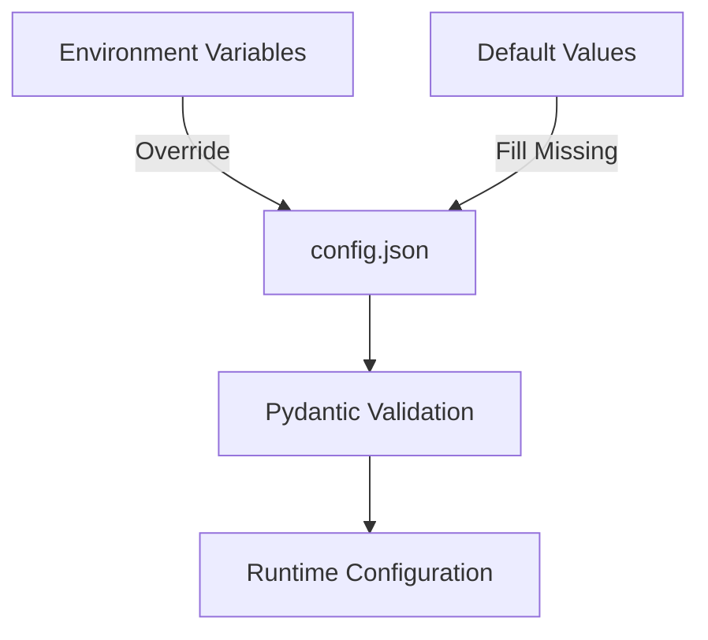

# 📋 Jellynouncer Configuration Guide

<div align="center">


**Complete configuration documentation for Jellynouncer - A Discord webhook service for Jellyfin media notifications**

[Quick Start](#-quick-start) • [Configuration](#-configuration-sections) • [Environment Variables](#-environment-variables) • [Examples](#-examples) • [Troubleshooting](#-troubleshooting)

</div>

---

## 📚 Table of Contents

- [🚀 Quick Start](#-quick-start)
- [🔧 Configuration System Overview](#-configuration-system-overview)
- [📁 Configuration Sections](#-configuration-sections)
  - [Jellyfin Settings](#jellyfin-settings)
  - [Discord Webhooks](#discord-webhooks)
  - [Database Configuration](#database-configuration)
  - [Web Interface & Authentication](#web-interface--authentication)
  - [SSL/TLS Security](#ssltls-security)
  - [Metadata Services](#metadata-services)
  - [Notification Behavior](#notification-behavior)
  - [Server Settings](#server-settings)
  - [Template Configuration](#template-configuration)
  - [Backup Configuration](#backup-configuration)
- [🔐 Environment Variables](#-environment-variables)
- [🔑 JWT Authentication](#-jwt-authentication)
- [📝 Examples](#-examples)
- [🐛 Troubleshooting](#-troubleshooting)
- [✅ Best Practices](#-best-practices)

---

## 🚀 Quick Start

### Minimal Configuration

Create a `config.json` file with the absolute minimum required settings:

```json
{
  "jellyfin": {
    "server_url": "http://your-jellyfin:8096",
    "api_key": "your_api_key",
    "user_id": "your_user_id"
  },
  "discord": {
    "webhooks": {
      "default": {
        "url": "https://discord.com/api/webhooks/...",
        "name": "General",
        "enabled": true
      }
    }
  }
}
```

### Using Environment Variables

For Docker deployments, override configuration using environment variables:

```bash
export JELLYFIN_SERVER_URL="http://jellyfin:8096"
export JELLYFIN_API_KEY="your_api_key"
export JELLYFIN_USER_ID="your_user_id"
export DISCORD_WEBHOOK_URL="https://discord.com/api/webhooks/..."
```

---

## 🔧 Configuration System Overview

### Configuration Hierarchy



### Key Features

- **Type Safety**: All configuration validated through Pydantic models
- **Environment Override**: Any setting can be overridden via environment variables
- **Sensible Defaults**: Most settings have intelligent defaults
- **Hot Reload**: Template changes reload without restart
- **Validation**: Comprehensive validation with helpful error messages

### Configuration Precedence

1. **Environment Variables** (highest priority)
2. **config.json** values
3. **Default values** (lowest priority)

---

## 📁 Configuration Sections

### Jellyfin Settings

Configure your Jellyfin server connection.

<details>
<summary><b>View Jellyfin Configuration Details</b></summary>

```json
{
  "jellyfin": {
    "server_url": null,
    "api_key": null,
    "user_id": null,
    "client_name": "JellyNotify-Discord-Webhook",
    "client_version": "1.0.0",
    "device_name": "jellynotify-webhook-service",
    "device_id": "jellynotify-discord-webhook-001"
  }
}
```

| Parameter | Type | Required | Default | Description |
|-----------|------|----------|---------|-------------|
| `server_url` | string | ✅ | - | Full URL to Jellyfin server (e.g., `http://jellyfin:8096`) |
| `api_key` | string | ✅ | - | Jellyfin API key for authentication |
| `user_id` | string | ✅ | - | Jellyfin user ID for notifications |
| `client_name` | string | ❌ | `"JellyNotify-Discord-Webhook"` | Client identifier shown in Jellyfin |
| `client_version` | string | ❌ | `"1.0.0"` | Version reported to Jellyfin |
| `device_name` | string | ❌ | `"jellynotify-webhook-service"` | Device name in Jellyfin dashboard |
| `device_id` | string | ❌ | `"jellynotify-discord-webhook-001"` | Unique device identifier |

**Getting These Values:**
- **API Key**: Jellyfin Dashboard → API Keys → Add API Key
- **User ID**: Jellyfin Dashboard → Users → Select User → Copy ID from URL
- **Server URL**: Use internal Docker hostname (e.g., `http://jellyfin:8096`) or external URL

</details>

### Discord Webhooks

Configure Discord webhook endpoints and routing.

<details>
<summary><b>View Discord Configuration Details</b></summary>

```json
{
  "discord": {
    "webhooks": {
      "default": {
        "url": null,
        "name": "General",
        "enabled": true,
        "grouping": {
          "mode": "none",
          "delay_minutes": 5,
          "max_items": 25
        }
      },
      "movies": { /* Same structure */ },
      "tv": { /* Same structure */ },
      "music": { /* Same structure */ }
    },
    "routing": {
      "enabled": false,
      "movie_types": ["Movie"],
      "tv_types": ["Episode", "Season", "Series"],
      "music_types": ["Audio", "MusicAlbum", "MusicArtist"],
      "fallback_webhook": "default"
    },
    "rate_limit": {
      "requests_per_period": 5,
      "period_seconds": 2,
      "channel_limit_per_minute": 30
    }
  }
}
```

#### Webhook Configuration

| Parameter | Type | Required | Default | Description |
|-----------|------|----------|---------|-------------|
| `url` | string | ✅* | `null` | Discord webhook URL (*required if webhook is enabled) |
| `name` | string | ✅ | - | Display name for webhook |
| `enabled` | boolean | ❌ | `false` | Enable/disable this webhook |
| `grouping.mode` | string | ❌ | `"none"` | Grouping: `"none"`, `"event_type"`, `"content_type"`, `"both"` |
| `grouping.delay_minutes` | integer | ❌ | `5` | Minutes to wait before sending grouped notifications |
| `grouping.max_items` | integer | ❌ | `25` | Maximum items per grouped notification |

#### Routing Configuration

| Parameter | Type | Required | Default | Description |
|-----------|------|----------|---------|-------------|
| `enabled` | boolean | ❌ | `false` | Enable content-type routing |
| `movie_types` | array | ❌ | `["Movie"]` | Jellyfin types considered movies |
| `tv_types` | array | ❌ | `["Episode", "Season", "Series"]` | Jellyfin types considered TV |
| `music_types` | array | ❌ | `["Audio", "MusicAlbum", "MusicArtist"]` | Jellyfin types considered music |
| `fallback_webhook` | string | ❌ | `"default"` | Webhook for unmatched content |

#### Rate Limiting

| Parameter | Type | Required | Default | Description |
|-----------|------|----------|---------|-------------|
| `requests_per_period` | integer | ❌ | `5` | Max requests per period |
| `period_seconds` | integer | ❌ | `2` | Rate limit period (seconds) |
| `channel_limit_per_minute` | integer | ❌ | `30` | Max messages per channel per minute |

</details>

### Database Configuration

SQLite database settings for media tracking.

<details>
<summary><b>View Database Configuration Details</b></summary>

```json
{
  "database": {
    "path": "/app/data/jellyfin_items.db",
    "wal_mode": true,
    "vacuum_interval_hours": 24
  }
}
```

| Parameter | Type | Required | Default | Description |
|-----------|------|----------|---------|-------------|
| `path` | string | ❌ | `"/app/data/jellyfin_items.db"` | SQLite database file path |
| `wal_mode` | boolean | ❌ | `true` | Enable WAL mode for concurrent access |
| `vacuum_interval_hours` | integer | ❌ | `24` | Hours between VACUUM operations (1-168) |

**Performance Notes:**
- WAL mode significantly improves concurrent read performance
- VACUUM reclaims space and optimizes queries
- Database size typically 30-50MB for 10,000 items

</details>

### Web Interface & Authentication

Configure the management web interface and authentication.

<details>
<summary><b>View Web Interface Configuration Details</b></summary>

```json
{
  "web_interface": {
    "enabled": true,
    "port": 1985,
    "host": "0.0.0.0",
    "jwt_secret": null,
    "auth_enabled": false,
    "ssl_enabled": false,
    "ssl_cert_path": null,
    "ssl_key_path": null,
    "ssl_port": 9000
  }
}
```

| Parameter | Type | Required | Default | Description |
|-----------|------|----------|---------|-------------|
| `enabled` | boolean | ❌ | `true` | Enable web management interface |
| `port` | integer | ❌ | `1985` | HTTP port (1024-65535) |
| `host` | string | ❌ | `"0.0.0.0"` | Bind address (`0.0.0.0` = all interfaces) |
| `jwt_secret` | string | ❌ | `null` | JWT secret key (auto-generated if null) |
| `auth_enabled` | boolean | ❌ | `false` | Require authentication |
| `ssl_enabled` | boolean | ❌ | `false` | Enable HTTPS |
| `ssl_cert_path` | string | ❌* | `null` | SSL certificate path (*required if SSL enabled) |
| `ssl_key_path` | string | ❌* | `null` | SSL private key path (*required if SSL enabled) |
| `ssl_port` | integer | ❌ | `9000` | HTTPS port (1024-65535) |

**Authentication Notes:**
- Authentication disabled by default to prevent lockouts
- Use web UI to enable authentication after initial setup
- JWT tokens expire after 30 minutes (access) and 7 days (refresh)

</details>

### SSL/TLS Security

Advanced SSL/TLS configuration for secure connections.

<details>
<summary><b>View SSL Configuration Details</b></summary>

```json
{
  "ssl": {
    "enabled": false,
    "cert_type": null,
    "cert_path": null,
    "key_path": null,
    "chain_path": null,
    "pfx_password": null,
    "port": 9000,
    "force_https": false,
    "hsts_enabled": false,
    "hsts_max_age": 31536000
  }
}
```

| Parameter | Type | Required | Default | Description |
|-----------|------|----------|---------|-------------|
| `enabled` | boolean | ❌ | `false` | Enable SSL/TLS |
| `cert_type` | string | ❌* | `null` | Certificate type: `"pem"` or `"pfx"` (*required if SSL enabled) |
| `cert_path` | string | ❌* | `null` | Certificate file path (*required if SSL enabled) |
| `key_path` | string | ❌* | `null` | Private key path (*required for PEM) |
| `chain_path` | string | ❌ | `null` | Certificate chain path (PEM only) |
| `pfx_password` | string | ❌ | `null` | PFX file password (PFX only) |
| `port` | integer | ❌ | `9000` | HTTPS port (1024-65535) |
| `force_https` | boolean | ❌ | `false` | Redirect HTTP to HTTPS |
| `hsts_enabled` | boolean | ❌ | `false` | Enable HSTS header |
| `hsts_max_age` | integer | ❌ | `31536000` | HSTS max-age (seconds) |

**Certificate Formats:**
- **PEM**: Separate certificate and key files (most common)
- **PFX/PKCS12**: Combined certificate, key, and chain in one file

**Example PEM Setup:**
```json
{
  "ssl": {
    "enabled": true,
    "cert_type": "pem",
    "cert_path": "/app/certs/cert.pem",
    "key_path": "/app/certs/key.pem",
    "chain_path": "/app/certs/chain.pem",
    "port": 443,
    "force_https": true,
    "hsts_enabled": true
  }
}
```

</details>

### Metadata Services

External metadata providers for enhanced content information.

<details>
<summary><b>View Metadata Services Configuration Details</b></summary>

```json
{
  "metadata_services": {
    "enabled": true,
    "omdb": {
      "enabled": false,
      "api_key": null,
      "base_url": "http://www.omdbapi.com/"
    },
    "tmdb": {
      "enabled": false,
      "api_key": null,
      "base_url": "https://api.themoviedb.org/3/"
    },
    "tvdb": {
      "enabled": false,
      "api_key": null,
      "base_url": "https://api4.thetvdb.com/v4/",
      "subscriber_pin": null
    },
    "cache_duration_hours": 168,
    "tvdb_cache_ttl_hours": 24,
    "request_timeout_seconds": 10,
    "retry_attempts": 3
  }
}
```

| Parameter | Type | Required | Default | Description |
|-----------|------|----------|---------|-------------|
| `enabled` | boolean | ❌ | `true` | Global metadata services toggle |
| `omdb.enabled` | boolean | ❌ | `false` | Enable OMDb (IMDb data) |
| `omdb.api_key` | string | ❌* | `null` | OMDb API key (*required if enabled) |
| `omdb.base_url` | string | ❌ | `"http://www.omdbapi.com/"` | OMDb API URL |
| `tmdb.enabled` | boolean | ❌ | `false` | Enable TMDb |
| `tmdb.api_key` | string | ❌* | `null` | TMDb API key (*required if enabled) |
| `tmdb.base_url` | string | ❌ | `"https://api.themoviedb.org/3/"` | TMDb API URL |
| `tvdb.enabled` | boolean | ❌ | `false` | Enable TVDb |
| `tvdb.api_key` | string | ❌* | `null` | TVDb v4 API key (*required if enabled) |
| `tvdb.base_url` | string | ❌ | `"https://api4.thetvdb.com/v4/"` | TVDb API URL |
| `tvdb.subscriber_pin` | string | ❌ | `null` | TVDb subscriber PIN (enhanced access) |
| `cache_duration_hours` | integer | ❌ | `168` | Rating cache duration (1-8760 hours) |
| `tvdb_cache_ttl_hours` | integer | ❌ | `24` | TVDb metadata cache (1-8760 hours) |
| `request_timeout_seconds` | integer | ❌ | `10` | API timeout (1-60 seconds) |
| `retry_attempts` | integer | ❌ | `3` | Retry attempts (1-10) |

**Metadata Priority Chain:**
- TV Shows: TVDb → TMDb → Jellyfin base
- Movies: TMDb → OMDb → Jellyfin base
- Music: Jellyfin base only

**Getting API Keys:**
- **OMDb**: [omdbapi.com/apikey.aspx](http://www.omdbapi.com/apikey.aspx) (1,000 requests/day free)
- **TMDb**: [themoviedb.org/settings/api](https://www.themoviedb.org/settings/api) (free with registration)
- **TVDb**: [thetvdb.com/api-information](https://thetvdb.com/api-information) (v4 API)

</details>

### Notification Behavior

Control what changes trigger notifications and their appearance.

<details>
<summary><b>View Notification Configuration Details</b></summary>

```json
{
  "notifications": {
    "watch_changes": {
      "resolution": true,
      "video_codec": true,
      "audio_codec": true,
      "audio_channels": true,
      "hdr_status": true,
      "file_size": false,
      "subtitles": true
    },
    "colors": {
      "new_item": 65280,
      "resolution_upgrade": 16766720,
      "codec_upgrade": 16747520,
      "audio_upgrade": 9662683,
      "hdr_upgrade": 16716947
    },
    "filter_renames": true,
    "filter_deletes": true
  }
}
```

#### Change Detection

| Parameter | Type | Required | Default | Description |
|-----------|------|----------|---------|-------------|
| `resolution` | boolean | ❌ | `true` | Detect resolution changes (720p→1080p→4K) |
| `video_codec` | boolean | ❌ | `true` | Detect video codec changes (H.264→H.265) |
| `audio_codec` | boolean | ❌ | `true` | Detect audio codec changes (AAC→DTS) |
| `audio_channels` | boolean | ❌ | `true` | Detect channel changes (2.0→5.1→7.1) |
| `hdr_status` | boolean | ❌ | `true` | Detect HDR changes (SDR→HDR10→DV) |
| `file_size` | boolean | ❌ | `false` | Detect size changes (>10% difference) |
| `subtitles` | boolean | ❌ | `true` | Detect subtitle track changes |

#### Filtering

| Parameter | Type | Required | Default | Description |
|-----------|------|----------|---------|-------------|
| `filter_renames` | boolean | ❌ | `true` | Filter out file renames/moves |
| `filter_deletes` | boolean | ❌ | `true` | Filter deletion notifications |

#### Discord Embed Colors (Decimal)

| Parameter | Type | Required | Default | Description |
|-----------|------|----------|---------|-------------|
| `new_item` | integer | ❌ | `65280` | Green - New content |
| `resolution_upgrade` | integer | ❌ | `16766720` | Orange - Resolution upgrade |
| `codec_upgrade` | integer | ❌ | `16747520` | Yellow - Codec upgrade |
| `audio_upgrade` | integer | ❌ | `9662683` | Purple - Audio upgrade |
| `hdr_upgrade` | integer | ❌ | `16716947` | Gold - HDR upgrade |

</details>

### Server Settings

FastAPI web server configuration.

<details>
<summary><b>View Server Configuration Details</b></summary>

```json
{
  "server": {
    "host": "0.0.0.0",
    "port": 1984,
    "log_level": "INFO",
    "run_mode": "all",
    "data_dir": "/app/data",
    "log_dir": "/app/logs",
    "environment": "production",
    "development_mode": false,
    "show_docker_interfaces": false,
    "allowed_hosts": [],
    "force_color_output": true,
    "disable_color_output": false
  }
}
```

| Parameter | Type | Required | Default | Description |
|-----------|------|----------|---------|-------------|
| `host` | string | ❌ | `"0.0.0.0"` | Bind address |
| `port` | integer | ❌ | `1984` | Webhook service port (1024-65535) |
| `log_level` | string | ❌ | `"INFO"` | Log level: DEBUG, INFO, WARNING, ERROR, CRITICAL |
| `run_mode` | string | ❌ | `"all"` | Services to run: `"all"`, `"webhook"`, `"web"` |
| `data_dir` | string | ❌ | `"/app/data"` | Data directory path |
| `log_dir` | string | ❌ | `"/app/logs"` | Log directory path |
| `environment` | string | ❌ | `"production"` | Environment: `"production"` or `"development"` |
| `development_mode` | boolean | ❌ | `false` | Enable development features |
| `show_docker_interfaces` | boolean | ❌ | `false` | Show Docker networks on startup |
| `allowed_hosts` | array | ❌ | `[]` | Allowed hosts (empty = all) |
| `force_color_output` | boolean | ❌ | `false` | Force colored logs |
| `disable_color_output` | boolean | ❌ | `false` | Disable colored logs |

</details>

### Template Configuration

Jinja2 template settings for Discord embeds.

<details>
<summary><b>View Template Configuration Details</b></summary>

```json
{
  "templates": {
    "directory": "/app/templates",
    "new_item_template": "new_item.j2",
    "upgraded_item_template": "upgraded_item.j2",
    "deleted_item_template": "deleted_item.j2",
    "new_items_by_event_template": "new_items_by_event.j2",
    "upgraded_items_by_event_template": "upgraded_items_by_event.j2",
    "new_items_by_type_template": "new_items_by_type.j2",
    "upgraded_items_by_type_template": "upgraded_items_by_type.j2",
    "new_items_grouped_template": "new_items_grouped.j2",
    "upgraded_items_grouped_template": "upgraded_items_grouped.j2"
  }
}
```

| Parameter | Type | Required | Default | Description |
|-----------|------|----------|---------|-------------|
| `directory` | string | ❌ | `"/app/templates"` | Template directory path |
| `new_item_template` | string | ❌ | `"new_item.j2"` | Single new item |
| `upgraded_item_template` | string | ❌ | `"upgraded_item.j2"` | Single upgrade |
| `deleted_item_template` | string | ❌ | `"deleted_item.j2"` | Single deletion |
| `new_items_by_event_template` | string | ❌ | `"new_items_by_event.j2"` | Grouped new items |
| `upgraded_items_by_event_template` | string | ❌ | `"upgraded_items_by_event.j2"` | Grouped upgrades |
| `new_items_by_type_template` | string | ❌ | `"new_items_by_type.j2"` | New by content type |
| `upgraded_items_by_type_template` | string | ❌ | `"upgraded_items_by_type.j2"` | Upgrades by type |
| `new_items_grouped_template` | string | ❌ | `"new_items_grouped.j2"` | Fully grouped new |
| `upgraded_items_grouped_template` | string | ❌ | `"upgraded_items_grouped.j2"` | Fully grouped upgrades |

</details>

### Backup Configuration

Automated backup settings for data protection.

<details>
<summary><b>View Backup Configuration Details</b></summary>

```json
{
  "backup": {
    "enabled": true,
    "backup_dir": "data/backups",
    "schedule": "daily",
    "backup_time": "02:00",
    "retention_days": 30,
    "max_backups": 10,
    "compress": true,
    "backup_config": true,
    "backup_database": true,
    "backup_templates": true,
    "backup_ssl": false,
    "backup_logs": false
  }
}
```

| Parameter | Type | Required | Default | Description |
|-----------|------|----------|---------|-------------|
| `enabled` | boolean | ❌ | `true` | Enable automatic backups |
| `backup_dir` | string | ❌ | `"data/backups"` | Backup storage directory |
| `schedule` | string | ❌ | `"daily"` | Schedule: `"hourly"`, `"daily"`, `"weekly"`, `"disabled"` |
| `backup_time` | string | ❌ | `"02:00"` | Time for daily/weekly (HH:MM) |
| `retention_days` | integer | ❌ | `30` | Days to keep backups (≥1) |
| `max_backups` | integer | ❌ | `10` | Maximum backup count (≥1) |
| `compress` | boolean | ❌ | `true` | Compress with gzip |
| `backup_config` | boolean | ❌ | `true` | Include configuration |
| `backup_database` | boolean | ❌ | `true` | Include database |
| `backup_templates` | boolean | ❌ | `true` | Include templates |
| `backup_ssl` | boolean | ❌ | `false` | Include SSL certificates |
| `backup_logs` | boolean | ❌ | `false` | Include log files |

</details>

---

## 🔐 Environment Variables

### Environment Variable Precedence

Environment variables **always override** config.json values. This allows secure credential management without modifying configuration files.

### Complete Environment Variable List

<details>
<summary><b>View All Environment Variables</b></summary>

#### Core Configuration

| Variable | Config Path | Description |
|----------|------------|-------------|
| `JELLYFIN_SERVER_URL` | `jellyfin.server_url` | Jellyfin server URL |
| `JELLYFIN_API_KEY` | `jellyfin.api_key` | Jellyfin API key |
| `JELLYFIN_USER_ID` | `jellyfin.user_id` | Jellyfin user ID |

#### Discord Webhooks

| Variable | Config Path | Description |
|----------|------------|-------------|
| `DISCORD_WEBHOOK_URL` | `discord.webhooks.default.url` | Default webhook |
| `DISCORD_WEBHOOK_MOVIES_URL` | `discord.webhooks.movies.url` | Movies webhook |
| `DISCORD_WEBHOOK_TV_URL` | `discord.webhooks.tv.url` | TV shows webhook |
| `DISCORD_WEBHOOK_MUSIC_URL` | `discord.webhooks.music.url` | Music webhook |

#### Metadata Services

| Variable | Config Path | Description |
|----------|------------|-------------|
| `OMDB_API_KEY` | `metadata_services.omdb.api_key` | OMDb API key |
| `TMDB_API_KEY` | `metadata_services.tmdb.api_key` | TMDb API key |
| `TVDB_API_KEY` | `metadata_services.tvdb.api_key` | TVDb API key |
| `TVDB_SUBSCRIBER_PIN` | `metadata_services.tvdb.subscriber_pin` | TVDb subscriber PIN |

#### Web Interface & Security

| Variable | Config Path | Description |
|----------|------------|-------------|
| `JWT_SECRET_KEY` | `web_interface.jwt_secret` | JWT secret for auth tokens |
| `SSL_CERT_PATH` | `ssl.cert_path` | SSL certificate path |
| `SSL_KEY_PATH` | `ssl.key_path` | SSL private key path |

#### Service Control

| Variable | Config Path | Description |
|----------|------------|-------------|
| `JELLYNOUNCER_RUN_MODE` | `server.run_mode` | Which services to run |
| `PORT` | `server.port` | Webhook service port |
| `WEB_PORT` | `web_interface.port` | Web interface port |
| `LOG_LEVEL` | `server.log_level` | Logging level |
| `LOG_DIR` | `server.log_dir` | Log directory |
| `DATABASE_PATH` | `database.path` | Database file path |
| `DATABASE_WAL_MODE` | `database.wal_mode` | Enable WAL mode |

#### Docker Environment

| Variable | Description |
|----------|-------------|
| `PUID` | User ID for file permissions |
| `PGID` | Group ID for file permissions |
| `TZ` | Timezone (e.g., `America/New_York`) |
| `NO_COLOR` | Disable colored output (`1` to disable) |
| `FORCE_COLOR` | Force colored output (`1` to force) |

</details>

### Docker Compose Example

```yaml
version: '3.8'

services:
  jellynouncer:
    image: jellynouncer:latest
    container_name: jellynouncer
    environment:
      # Required
      - JELLYFIN_SERVER_URL=http://jellyfin:8096
      - JELLYFIN_API_KEY=${JELLYFIN_API_KEY}
      - JELLYFIN_USER_ID=${JELLYFIN_USER_ID}
      - DISCORD_WEBHOOK_URL=${DISCORD_WEBHOOK_URL}
      
      # Optional
      - JWT_SECRET_KEY=${JWT_SECRET_KEY:-auto-generated}
      - LOG_LEVEL=INFO
      - TZ=America/New_York
      - PUID=1000
      - PGID=1000
    volumes:
      - ./config:/app/config
      - ./data:/app/data
      - ./logs:/app/logs
    ports:
      - "1984:1984"  # Webhook service
      - "1985:1985"  # Web interface
    restart: unless-stopped
```

---

## 🔑 JWT Authentication

### How JWT Authentication Works

1. **Token Types**:
   - **Access Token**: Short-lived (30 minutes), used for API requests
   - **Refresh Token**: Long-lived (7 days), used to get new access tokens

2. **Token Generation**:
   - Tokens are signed with `JWT_SECRET_KEY`
   - If not provided, a secure key is auto-generated on first run
   - Auto-generated keys persist across restarts

3. **Authentication Flow**:
   ```mermaid
   sequenceDiagram
       participant User
       participant WebUI
       participant API
       User->>WebUI: Login with credentials
       WebUI->>API: POST /api/auth/login
       API->>WebUI: Access + Refresh tokens
       WebUI->>API: Request with Bearer token
       API->>WebUI: Protected resource
       Note over WebUI,API: After 30 minutes
       WebUI->>API: POST /api/auth/refresh
       API->>WebUI: New access token
   ```

### Security Configuration

<details>
<summary><b>View Security Best Practices</b></summary>

#### Sensitive Value Handling

The system intelligently handles sensitive values to prevent accidental exposure:

1. **Display Behavior**:
   - Sensitive values show as `**HIDDEN**` in the web UI
   - Applies to API keys, JWT secrets, webhook URLs, passwords

2. **Save Behavior**:
   - Values from environment variables: Can save `**HIDDEN**` (env var takes precedence)
   - Values from config.json: Preserves actual value (prevents data loss)

#### Emergency Access Recovery

If locked out, use the JWT_SECRET_KEY to regain access:

```python
import jwt
from datetime import datetime, timedelta

secret = "your-jwt-secret-key"  # Same as JWT_SECRET_KEY
payload = {
    "user_id": 1,
    "username": "admin",
    "type": "access",
    "exp": datetime.utcnow() + timedelta(minutes=30)
}
token = jwt.encode(payload, secret, algorithm="HS256")
print(f"Bearer {token}")
```

Use the token to disable auth:
```bash
curl -X PUT "http://localhost:1985/api/auth/settings" \
  -H "Authorization: Bearer YOUR_TOKEN" \
  -H "Content-Type: application/json" \
  -d '{"auth_enabled": false}'
```

</details>

---

## 📝 Examples

### Minimal Docker Setup

<details>
<summary><b>View Minimal Configuration</b></summary>

```json
{
  "jellyfin": {
    "server_url": "http://jellyfin:8096",
    "api_key": "abc123",
    "user_id": "user123"
  },
  "discord": {
    "webhooks": {
      "default": {
        "url": "https://discord.com/api/webhooks/123/abc",
        "enabled": true
      }
    }
  }
}
```

</details>

### Multi-Channel with Routing

<details>
<summary><b>View Multi-Channel Configuration</b></summary>

```json
{
  "jellyfin": {
    "server_url": "http://jellyfin:8096",
    "api_key": "abc123",
    "user_id": "user123"
  },
  "discord": {
    "webhooks": {
      "default": {
        "url": "https://discord.com/api/webhooks/123/default",
        "name": "General",
        "enabled": true
      },
      "movies": {
        "url": "https://discord.com/api/webhooks/123/movies",
        "name": "🎬 Movies",
        "enabled": true,
        "grouping": {
          "mode": "event_type",
          "delay_minutes": 5,
          "max_items": 10
        }
      },
      "tv": {
        "url": "https://discord.com/api/webhooks/123/tv",
        "name": "📺 TV Shows",
        "enabled": true,
        "grouping": {
          "mode": "both",
          "delay_minutes": 3,
          "max_items": 15
        }
      }
    },
    "routing": {
      "enabled": true,
      "fallback_webhook": "default"
    }
  }
}
```

</details>

### Production with SSL & Auth

<details>
<summary><b>View Production Configuration</b></summary>

```json
{
  "jellyfin": {
    "server_url": "https://jellyfin.example.com",
    "api_key": "production_key",
    "user_id": "admin_user"
  },
  "web_interface": {
    "enabled": true,
    "auth_enabled": true,
    "ssl_enabled": true,
    "ssl_cert_path": "/app/certs/cert.pem",
    "ssl_key_path": "/app/certs/key.pem",
    "ssl_port": 443
  },
  "ssl": {
    "enabled": true,
    "cert_type": "pem",
    "cert_path": "/app/certs/cert.pem",
    "key_path": "/app/certs/key.pem",
    "force_https": true,
    "hsts_enabled": true
  },
  "metadata_services": {
    "enabled": true,
    "tmdb": {
      "enabled": true,
      "api_key": "tmdb_key"
    },
    "cache_duration_hours": 72
  },
  "discord": {
    "webhooks": {
      "default": {
        "url": "https://discord.com/api/webhooks/123/prod",
        "enabled": true
      }
    },
    "rate_limit": {
      "requests_per_period": 3,
      "period_seconds": 2,
      "channel_limit_per_minute": 20
    }
  },
  "backup": {
    "enabled": true,
    "schedule": "daily",
    "backup_time": "03:00",
    "retention_days": 30
  }
}
```

</details>

---

## 🐛 Troubleshooting

### Common Issues

<details>
<summary><b>View Troubleshooting Guide</b></summary>

#### Invalid JSON Format
```
ERROR: Invalid configuration file format: Expecting ',' delimiter
```
**Solution**: Validate JSON at [jsonlint.com](https://jsonlint.com/)

#### Missing Required Fields
```
ERROR: Missing required Jellyfin server URL
```
**Solution**: Ensure all required fields are set

#### Invalid Webhook URL
```
WARNING: Invalid Discord webhook URL format
```
**Solution**: URL must match `https://discord.com/api/webhooks/...`

#### Database Permission Issues
```
ERROR: Cannot write to database path
```
**Solution**: Check file permissions and directory writability

#### SSL Certificate Not Found
```
ERROR: SSL certificate file not found: /app/certs/cert.pem
```
**Solution**: Verify certificate paths and file existence

#### JWT Token Expired
```
ERROR: JWT token has expired
```
**Solution**: Use refresh token or re-authenticate

</details>

### Validation Commands

```bash
# Check configuration validity
docker exec jellynouncer cat /app/config/config.json | python -m json.tool

# Test webhook connectivity
curl -X POST "http://localhost:1984/test-webhook?webhook_name=default"

# Check service health
curl http://localhost:1984/health
curl http://localhost:1985/api/health

# View startup logs
docker logs jellynouncer | head -50

# Check for errors
docker logs jellynouncer | grep ERROR
```

---

## ✅ Best Practices

### Security

1. **Use Environment Variables for Secrets**
   ```bash
   export JELLYFIN_API_KEY="secure_key"
   export JWT_SECRET_KEY="random_32_char_string"
   ```

2. **Enable Authentication**
   - Use web UI to setup initial admin account
   - Enable auth after account creation

3. **Use SSL in Production**
   - Generate proper certificates
   - Enable HSTS for security
   - Force HTTPS redirects

### Performance

1. **Optimize Database**
   ```json
   {
     "database": {
       "wal_mode": true,
       "vacuum_interval_hours": 24
     }
   }
   ```

2. **Configure Rate Limiting**
   ```json
   {
     "discord": {
       "rate_limit": {
         "requests_per_period": 5,
         "channel_limit_per_minute": 30
       }
     }
   }
   ```

3. **Use Notification Grouping**
   - Reduces Discord API calls
   - Improves readability
   - Prevents spam

### Maintenance

1. **Enable Backups**
   ```json
   {
     "backup": {
       "enabled": true,
       "schedule": "daily",
       "retention_days": 30
     }
   }
   ```

2. **Set Appropriate Logging**
   - `INFO` for production
   - `DEBUG` for troubleshooting
   - Rotate logs regularly

3. **Monitor Resources**
   - Check database size
   - Monitor memory usage
   - Review error logs

---

<div align="center">

**📚 Related Documentation**

[Main README](../README.md) • [Templates Guide](../templates/README.md) • [API Documentation](../docs/API.md)

**Need Help?**

[Open an Issue](https://github.com/jellynouncer/jellynouncer/issues) • [Discord Support](https://discord.gg/jellynouncer)

</div>